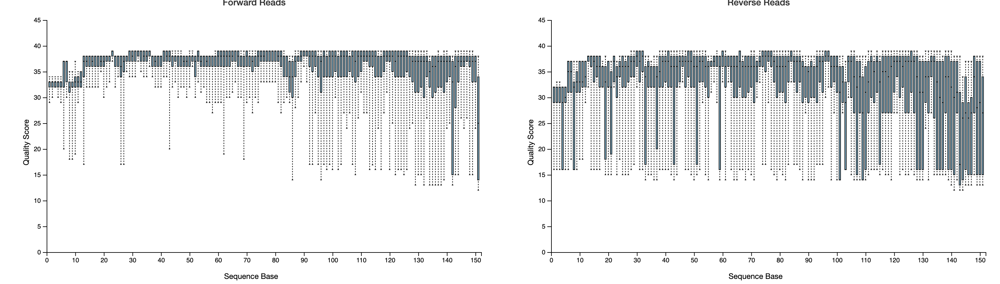

## Table of Contents


- [1. Introduction](#introduction)
- [2. Installation and setup](#installation-and-setup)
- [3. Read and process the data](#read-and-process-the-data)
	- [3.1 Demultiplexing](#demultiplexing)
	- [3.2 Denoising](#denoising)
- [4. Phylogenetic diversity analyses](#phylogenetic-diversity-analyses)
	- [4.1 Categorical tests](#categorical-tests)
	- [4.2 Continuous tests](#continuous-tests)
	- [4.3 Alpha rarefaction](#alpha-rarefaction)
- [5. Taxonomic analysis](#taxonomic-analysis)
- [6. Differential abundance testing with ANCOM](#differential-abundance-testing-with-ancom)
- [7. Some other useful approaches](#some-other-useful-approaches)


<br><br><br><br><br><br>
<br><br><br><br><br><br>
<center>

</center>
<br><br><br>

## 1. Introduction

QIIME2 is a pipeline for metabarcoding analysis described in [this paper](https://www.nature.com/articles/s41587-019-0209-9). It is a piece of software that wraps around several other programs via "plugins" in QIIME2 lingo. For example, in the error correction or "denoising" step, one option is to use the `dada2` plugin to run [DADA2](https://benjjneb.github.io/dada2/). DADA2 is incorporated into the QIIME2 pipeline, but is not developed or maintained by the same group that develops and maintains QIIME2. Users can develop their own plugins and contribute them to the QIIME2 pipeline to extend functionality as new methods are developed.

The greatest advantage of QIIME2 is that it aggregates various tools into a single pipeline that uses a common grammar. This includes unifying data formatting so that users do not need to worry about complex file conversions to prep output from one program for input into another, which I personally find to be one of the most obnoxious hassles in bioinformatic analysis.

Another advantage of QIIME2 is that the files track the provenance of the data--i.e., QIIME2 tracks exactly how the data has been processed at every step up to any given analysis. We will explore this further as we start looking at QIIME2 files.


Today, we will use QIIME2 to explore soil microbiome data from the Atacama desert in Chile. The data are presented in [this paper](https://journals.asm.org/doi/full/10.1128/mSystems.00195-16).

This tutorial is adapted from the following tutorials in the QIIME2 documentation: [“Atacama soil microbiome” tutorial](https://docs.qiime2.org/2022.2/tutorials/atacama-soils/), [“Moving Pictures” tutorial](https://docs.qiime2.org/2022.2/tutorials/moving-pictures/), [Training feature classifiers](https://docs.qiime2.org/2022.2/tutorials/feature-classifier/). The QIIME2 documentation is extensive and features several tutorials. More detail on all of the concepts that we will cover today can be found in this documentation. 

Blocks of code to be entered into your command line terminal will look like this:

```
# This is a code block
```

The `#` denotes a comment in the bash language, and anything following that will not be interpreted by the system.


<br><br><br>


## 2. Installation and setup

As discussed above, QIIME2 is not a single program, but a pipeline that incorporates multiple other programs. This means that installation of QIIME2 is not a trivial endeavor because it has a whole slew of dependencies and components. Fortunately, these have all been combined into easily installed conda environments and virtual machines.

I find conda installation to be the easiest (both here and for many other programs). conda allows users to create separate environments that programs are installed into, which allows users to have multiple versions of the same program all installed on the same machine, each within a different conda environment. This can be very useful with QIIME2 because some versions of QIIME2 have different features or support different plugins. Full details of QIIME2 installation options can be found [here](https://docs.qiime2.org/2022.2/install/), but we'll stick with conda:

If you do not already have a conda install on your system, install miniconda following the instructions [here](https://conda.io/projects/conda/en/latest/user-guide/install/index.html).


Then run the following to download the conda environment file and install QIIME2 from file into that environment at the same time. Note that most conda installs of other programs can be done from a remote source without first downloading a file.


```
conda install wget
wget https://data.qiime2.org/distro/core/qiime2-2022.2-py38-osx-conda.yml
conda env create -n qiime2-2022.2 --file qiime2-2022.2-py38-osx-conda.yml
rm qiime2-2022.2-py38-osx-conda.yml
```

To use QIIME2 now or at any point in the future, you will need to activate the `qiime2-2022.2` environment. If the environment is not active, your system will not know where to look for the QIIME2 software. 

Activate the environment and test the install:

```
conda activate qiime2-2022.2
qiime --help
```

This should spit out the help menu for QIIME2 if everything worked as expected.


You can deactivate the environment by running `conda deactivate` -- if you run it now, you will need to activate it again, though.

You can always check what conda environments you have and which you are currently in by running `conda env list`. The active environment will have `*` next to it.


Now that we have QIIME2 installed, let's download the data that we'll be working with. Create a new directory, move into that directory, and then download the data there. We'll work from within this directory for the duration of our QIIME2 analyses.

```
mkdir qiime2-atacama-tutorial
cd qiime2-atacama-tutorial

conda install wget
wget \
  -O "sample-metadata.tsv" \
  "https://data.qiime2.org/2022.2/tutorials/atacama-soils/sample_metadata.tsv"
  
mkdir emp-paired-end-sequences
wget \
  -O "emp-paired-end-sequences/forward.fastq.gz" \
  "https://data.qiime2.org/2022.2/tutorials/atacama-soils/10p/forward.fastq.gz"
wget \
  -O "emp-paired-end-sequences/reverse.fastq.gz" \
  "https://data.qiime2.org/2022.2/tutorials/atacama-soils/10p/reverse.fastq.gz"
wget \
  -O "emp-paired-end-sequences/barcodes.fastq.gz" \
  "https://data.qiime2.org/2022.2/tutorials/atacama-soils/10p/barcodes.fastq.gz"
  
```

Note that the slashes are just escaping line endings so that `wget` commands are interpreted as a single-line commands while allowing them to easily fit on this page.

We should now have the sample metadata, raw reads, and barcodes for the samples.

Take a look at the sample metadata in the `sample_metadata.tsv` file to get familiar with what we're working with here. We have a mixture of categorical variables, such as site-name, and continuous variables, such as elevation.


<br><br><br>


## 3. Read and process the data

Now we can import the data and prepare it for analysis in QIIME2. As touched on above, QIIME2 puts things into its own file format, and so the first step is to read the raw data into QIIME2 format.


```
qiime tools import \
   --type EMPPairedEndSequences \
   --input-path emp-paired-end-sequences \
   --output-path emp-paired-end-sequences.qza
```


This creates a QIIME2 file called an artifact. QIIME2 uses two file formats, "QIIME zipped artifacts" or ".qza" files and "QIIME zipped visualizations" or ".qzv" files. Both are just zip files with different names. qza files contain data and provenance (information about what has been done to the data) while qzv files, which we'll see shortly, contain visualizations, as the name suggests.

<br><br>

### 3.1 Demultiplexing

We now need to demultiplex the sequences, which sorts the reads into samples based on barcodes added in the library preparation.

```
qiime demux emp-paired \
  --m-barcodes-file sample-metadata.tsv \
  --m-barcodes-column barcode-sequence \
  --p-rev-comp-mapping-barcodes \
  --i-seqs emp-paired-end-sequences.qza \
  --o-per-sample-sequences demux-full.qza \
  --o-error-correction-details demux-details.qza
```


Note that most options to QIIME2 commands share a general structure. They all start `qiime`, followed by the plugin being used (`demux` here), then the specific method being applied (here `emp-paired` to demultiplex paired-end data generated with the EMP protocol), followed by arguments. Arguments starting `--i` designate input, arguments starting `--o` designate output, arguments starting `--m` designate metadata, and arguments starting `--p` (we'll see these in a second) designate parameters being fed to the method being used. You can get help for plugins or methods by typing `--help`, e.g., `qiime demux --help` or `qiime demux emp-paired --help`.


To make things run faster, we'll subsample only 30% of the reads. **This is not a general step for most pipelines**. You will typically want to use all of your data unless you have a specific reason for subsampling.

```
qiime demux subsample-paired \
  --i-sequences demux-full.qza \
  --p-fraction 0.3 \
  --o-subsampled-sequences demux-subsample.qza

qiime demux summarize \
  --i-data demux-subsample.qza \
  --o-visualization demux-subsample.qzv
```


Before we go any further, let's do a quick exploration of a .qza file. We can use [https://view.qiime2.org/](https://view.qiime2.org/) to examine these. Bring the `demux-subsample.qza` file into that website. It will start in the details tab, where you can see information about the format as well as citations. You can see that even just for demultiplexing, there are already three citations. These should all go into your methods section, along with a detailed description of the specific commands, plugins, and arguments that you used to run your analyses and process your data: "we demultiplexed the data using QIIME2" is not adequate for anyone to reproduce your results. The QIIME2 documentation has excellent examples of good and bad description of QIIME2 methods sections [here](https://docs.qiime2.org/2022.2/citation/).

You can also click on the "provenance" tab to see what manipulations have been done to your data. You should see something like this:

<center>

</center>


This tells us important information, but isn't very interesting from a scientific perspective of trying to learn about the data and make inferences. Visualiztion (qzv) files are much more intersting for these purposes. We can use a terminal command to view visualization files:

```
qiime tools view demux-subsample.qzv
```

The `Overview` tab shows some general stats on how many reads we have per sample. From looking at the histograms, we see that a lot of samples have very few reads. If we scroll down to look at the table, we see that we have a lot of samples that have fewer than 100 reads in them. 

<center>

</center>

<center>

</center>


This isn't enough reads for meaningful analysis, so we'll filter these out in the next step. You do not necessarily need to run through this step in other analyses. Think carefully about what thresholds you may want to use when filtering out any data.

```
qiime tools export \
  --input-path demux-subsample.qzv \
  --output-path ./demux-subsample/

qiime demux filter-samples \
  --i-demux demux-subsample.qza \
  --m-metadata-file ./demux-subsample/per-sample-fastq-counts.tsv \
  --p-where 'CAST([forward sequence count] AS INT) > 100' \
  --o-filtered-demux demux.qza
```

<br><br>

### 3.2 Denoising

Our next step is to "denoise", or error correct, the data. This is an important step in the analysis of metabarcoding data because the units of analysis are unique sequences, presumed to be from unique organisms. However, all sequencers encounter sequencing errors, which produce sequences that are slightly different from the true sequence. We will use DADA2 (via the dada2 plugin) to error correct our data--this is a complex process, and you can read more about it [here](https://www.nature.com/articles/nmeth.3869)--this is not the only option for error correction in QIIME2. This step will also include some trimming of our reads and will merge the forward and reverse reads. To determine some of our trimming paramters, let's go back to our demultiplexed visualization and look in the `Interactive Quality Plot` tab

```
qiime tools view demux-subsample.qzv
```

You should see something like this:

<center>

</center>


We have 150 bp paired-end reads, and quality is reasonably high throughout, but we can see that the first ~13 bp of both forward and reverse reads is a little low, so we'll trim those out. We'll also truncate reads in both directions to 150 bp, since none should be longer than this. Note that we have set these the same for forward and reverse reads, but that is not necessary.


```
qiime dada2 denoise-paired \
  --i-demultiplexed-seqs demux.qza \
  --p-trim-left-f 13 \
  --p-trim-left-r 13 \
  --p-trunc-len-f 150 \
  --p-trunc-len-r 150 \
  --o-table table.qza \
  --o-representative-sequences rep-seqs.qza \
  --o-denoising-stats denoising-stats.qza
```

Let's generate a few summaries of this ouput:

```
qiime feature-table summarize \
  --i-table table.qza \
  --o-visualization table.qzv \
  --m-sample-metadata-file sample-metadata.tsv

qiime feature-table tabulate-seqs \
  --i-data rep-seqs.qza \
  --o-visualization rep-seqs.qzv

qiime metadata tabulate \
  --m-input-file denoising-stats.qza \
  --o-visualization denoising-stats.qzv
```

Then use `qiime tools view` as we did above on each of these three visualizations (`table.qzv`, `rep-seqs.qzv`, `denoising-stats.qzv`) to explore them.


<br><br><br>

## 4. Phylogenetic diversity analyses


Now that we have the data fully read in and processed, we can start to do some analysis that will tell us about the biology of our system. We're going to start with diversity analyses. This includes how many taxa we have in our samples, how distinct the taxonomic composition of different samples or metadata categories are, and related metrics.

Many of these metrics include phylogenetic distance in their calculation, and to do that, we need a tree. We'll start by making one. We'll use the `phylogeny` plugin to use the [MAFFT](https://mafft.cbrc.jp/alignment/software/) program for sequence alignment, followed by phylogenetic analysis in the program [FastTree](http://www.microbesonline.org/fasttree/). As for many of the methods in QIIME2, these are external programs that are being called by the QIIME2 pipeline. There are multiple other options that you can explore using `--help`.

```
qiime phylogeny align-to-tree-mafft-fasttree \
  --i-sequences rep-seqs.qza \
  --o-alignment aligned-rep-seqs.qza \
  --o-masked-alignment masked-aligned-rep-seqs.qza \
  --o-tree unrooted-tree.qza \
  --o-rooted-tree rooted-tree.qza
```


Next, we can start to calculate some diversity metrics. We have to specify a minimum sampling depth (`--p-sampling-depth`) for these calculations. This threshold is important: any samples with more than the specified depth will be randomly sampled to contain only that many features, whereas samples with fewer features will be discarded from analysis. 

This is necessary because using different numbers of features across samples can bias estimates of diversity. There is no easy rule for selecting this threshold, other than that we want to try to select a threshold that maximizes the number of features without dropping out too many samples. Let's look at the *Interactive Sample Detail* section of `table.qzv` to help us figure out what threshold to use.

```
qiime tools view table.qzv
```

In this document, click on the *Interactive Sample Detail*  tab up top. As you move the *Sampling Depth* slider around you can see a visual representation of how many samples will be retained. You can also scroll down the table to see if there is a point at which there is a sharp decline in the Feature Counts, the value just prior to such a drop off can be good to use.

What do you think is a reasonable value to use? 

When selecting this threshold, keep in mind that we also want to keep an eye on how dropping out samples affects how many samples we retain in different metadata categories. E.g., if we had 5 samples from each of two locations that we want to compare, a sampling threshold that excludes all samples from one of those sites would make comparisons impossible.

Once we've selected a good sampling depth, we can calculate our diversity metrics:


```
qiime diversity core-metrics-phylogenetic \
  --i-phylogeny rooted-tree.qza \
  --i-table table.qza \
  --p-sampling-depth 733 \
  --m-metadata-file sample-metadata.tsv \
  --output-dir core-metrics-results
```

This generates a lot of output that is worth looking through, take a look at all of the artifacts and visualizations that were created: `ls core-metrics-results`.

For each of the beta diversity metrics, a principal coordinates analysis (PCoA) plot was generated using Emperor. Let's take a look at one of them:

```
qiime tools view core-metrics-results/bray_curtis_emperor.qzv
```

For continuous variables, try selecting a color scheme from the sequential or diverging sets of colors, these should make it easier to identify trends.

Are there any particular variables that seem to be strongly associated with beta diversity?

<br><br>

### 4.1 Categorical tests

Now that we have computed the diversity metrics and done some qualitative exploration of the emperor plots, we can explicitly test for associations between these diversity metrics and the sample metadata. We can test for differences among categorical groups (e.g., using the `vegetation` column, which is yes/no) or correlations with continuous variables, such as `percentcover`. 

Let's start with categorical tests using the evenness and Faith Phylogenetic Diversity metrics. 


```
qiime diversity alpha-group-significance \
  --i-alpha-diversity core-metrics-results/evenness_vector.qza \
  --m-metadata-file sample-metadata.tsv \
  --o-visualization core-metrics-results/evenness-group-significance.qzv
  

qiime diversity alpha-group-significance \
  --i-alpha-diversity core-metrics-results/faith_pd_vector.qza \
  --m-metadata-file sample-metadata.tsv \
  --o-visualization core-metrics-results/faith-pd-group-significance.qzv  
```

Take a look at these results:

```
qiime tools view core-metrics-results/evenness-group-significance.qzv

qiime tools view core-metrics-results/faith-pd-group-significance.qzv
```

What associations are statistically significant?


Now let's look at how beta diversity composition varies across categorical variables using PERMANOVA. This tests if distances between samples within a group are more similar to each other than to samples from other groups. Because it uses permutation to assess significance, this command can be slow, and so we will only run it on the vegetation column of our metadata right now. The addition of the `--p-pairwise` option will perform pairwise tests to determine which groups are significantly different from each other--note that this is redundant here because we only have two groups for vegetation.

```
qiime diversity beta-group-significance \
  --i-distance-matrix core-metrics-results/unweighted_unifrac_distance_matrix.qza \
  --m-metadata-file sample-metadata.tsv \
  --m-metadata-column vegetation \
  --o-visualization core-metrics-results/unweighted-unifrac-vegetation-significance.qzv \
  --p-pairwise
```

Take a look:

```
qiime tools view core-metrics-results/unweighted-unifrac-vegetation-significance.qzv
```


<center>

</center>


Are there any other categorical comparisons that are worth making?

<br><br>

### 4.2 Continuous tests

We can also make correlations between diversity and continuous variables from the metadata. As above, we'll start with alpha diversity:

```
qiime diversity alpha-correlation \
	--i-alpha-diversity core-metrics-results/faith_pd_vector.qza \
	--m-metadata-file sample-metadata.tsv \
	--p-method spearman \
	--o-visualization core-metrics-results/faith-pd-correlation.qzv  
```


View it:

```
qiime tools view core-metrics-results/faith-pd-correlation.qzv
```

What relationships are significant? Note that we can also run this correlation using evenness or with a Pearson correlation test instead of Spearman.


Let's now look for significant correlations using beta diversity.

To do this, we need to first calculate a distance matrix from the column of interest from the metadata. Here we'll use just elevation, but you are free to explore other variables as well. 


```
qiime metadata distance-matrix \
	--m-metadata-file sample-metadata.tsv \
	--m-metadata-column elevation \
	--o-distance-matrix core-metrics-results/elevation-dist-mat.qza
```


Then we can use a Mantel test to test for an association between this distance matrix and one of our metrics of beta diversity. We'll use just unweighted unifrac distance, but we can do this with any metric.


```
qiime diversity mantel \
	--i-dm1 core-metrics-results/elevation-dist-mat.qza \
	--i-dm2 core-metrics-results/unweighted_unifrac_distance_matrix.qza \
	--p-method spearman \
	--p-label1 elevation \
	--p-label2 unweighted_unifrac \
	--p-intersect-ids \
	--o-visualization core-metrics-results/unweight_unifrac_elevation_mantel.qzv
```

View the resulting visualization:


```
qiime tools view core-metrics-results/unweight_unifrac_elevation_mantel.qzv
```

You'll see a warning that 27 IDs weren't shared between your distance matrices. This is because early on we filtered out some samples, then further filtered samples for sampling depth during the calculation of diversity metrics, whereas the metadata contains all samples. This mismatch is why we need to include the `--p-intersect-ids` flag here to tell the analysis to only include samples in both distance matrices that we input.


We could alternately use the `qiime diversity bioenv` method in a similar way to test for relationships between continuous variables and beta diversity metrics, but we won't explore it here. You can run `qiime diversity mantel --help` for more info on this. 

<br><br>

### 4.3 Alpha rarefaction

Alpha rarefaction plotting will compute alpha diversity at multiple sampling depths and then visualize how increased sampling affects estimates of alpha diversity. 


```
qiime diversity alpha-rarefaction \
  --i-table table.qza \
  --i-phylogeny rooted-tree.qza \
  --p-max-depth 1175 \
  --m-metadata-file sample-metadata.tsv \
  --o-visualization alpha-rarefaction.qzv
```


The parameter `--p-max-depth` should be chosen from the information in `table.qzv` that we generated previously. Using roughly the median frequency is generally recommended, but you may want to increase the value if your rarefaction plot does not level out or decrease it if you are losing many of your samples at this depth. We've chosen the median above, let's see how it looks:


```
qiime tools view alpha-rarefaction.qzv
```


The top plot shows us how much diversity we detect at varying sequencing depths. We should specifically check the value that we used for `--p-sampling-depth` when calculating diversity metrics looks good.

If the plot has leveled off, we can be reasonably confident that we are accurately characterizing the diversity in our samples. If the plots do not level off, that suggests that further sequencing may be needed to detect additional features in the samples and accurately characterize diversity.

How does this plot look to you? Do you think that the sequencing depth is adequate?

The bottom plot shows the number of samples that remain in each category when grouping by metadata columns. This is important to look at because if the diversity metric in the top plot is calculated from very few samples at a given sampling depth, that estimate of diversity may be unreliable. In fact, if you look at Shannon diversity for vegetation, you can see that at the highest sequencing depth, the number of samples drops low and so does the Shannon index.

<center>

</center>


<br><br><br>

## 5. Taxonomic analysis


Next up, we'll start to explore the taxonomic composition of our samples. We will start by training a taxonomic classifier. We don't have time to get into how this works, but you can read all about it [here](https://microbiomejournal.biomedcentral.com/articles/10.1186/s40168-018-0470-z). There are several existing, pre-trained classifiers that exist for QIIME2, but the developers recommend training your own classifier, as they perform best when tailored to your specific data.

We'll follow the documentation [here](https://docs.qiime2.org/2022.2/tutorials/feature-classifier/) to train our classifier. We'll use the Greengenes 13_8 85% OTU dataset -- as they state in the documentation **this dataset is not recommended for real data** -- we are using it here for the sake of time efficiency.


Start by creating a new directory, moving into it, and then downloading the data that we will use to train the classifier.

```
mkdir training-feature-classifiers
cd training-feature-classifiers
wget \
  -O "85_otus.fasta" \
  "https://data.qiime2.org/2022.2/tutorials/training-feature-classifiers/85_otus.fasta"

wget \
  -O "85_otu_taxonomy.txt" \  "https://data.qiime2.org/2022.2/tutorials/training-feature-classifiers/85_otu_taxonomy.txt"
```

If that all ran successfully, you should now have three files in your current directory, a fasta, txt, and qza file.


Then we need to import these data as QIIME artifact files.

```
qiime tools import \
  --type 'FeatureData[Sequence]' \
  --input-path 85_otus.fasta \
  --output-path 85_otus.qza

qiime tools import \
  --type 'FeatureData[Taxonomy]' \
  --input-format HeaderlessTSVTaxonomyFormat \
  --input-path 85_otu_taxonomy.txt \
  --output-path ref-taxonomy.qza
```

Next up, we'll extract the reads from the reference sequences to match our data. Here we use the same primers that were used to generate the data and set some min & max length parameters to exclude amplicons that are too short or long. We won't truncate the reads to a specific length because we have paired end data, and the merged reads end up as variable lengths.


```
qiime feature-classifier extract-reads \
  --i-sequences 85_otus.qza \
  --p-f-primer GTGCCAGCMGCCGCGGTAA \
  --p-r-primer GGACTACHVGGGTWTCTAAT \
  --p-min-length 100 \
  --p-max-length 400 \
  --o-reads ref-seqs.qza
```


Then we can run the Naive Bayes classifier.

```
qiime feature-classifier fit-classifier-naive-bayes \
  --i-reference-reads ref-seqs.qza \
  --i-reference-taxonomy ref-taxonomy.qza \
  --o-classifier classifier.qza
```

This has trained the classifier on the reference data. Now we can run the classifier on our data to determine what taxa are present in our samples. Then we can make a visualization of this.


```
cd ..  # We first need to move up one level to get out of the classifier directory

qiime feature-classifier classify-sklearn \
  --i-classifier training-feature-classifiers/classifier.qza \
  --i-reads rep-seqs.qza \
  --o-classification taxonomy.qza

qiime metadata tabulate \
  --m-input-file taxonomy.qza \
  --o-visualization taxonomy.qzv
```


Let's take a look.


```
qiime tools view taxonomy.qzv
```

This is useful information, but doesn't tell us much at a glance, so let's make some bar plots:

```
qiime taxa barplot \
  --i-table table.qza \
  --i-taxonomy taxonomy.qza \
  --m-metadata-file sample-metadata.tsv \
  --o-visualization taxa-bar-plots.qzv


qiime tools view taxa-bar-plots.qzv
```

We can now explore the taxonomic composition of the samples at various taxonomic levels and grouping by the different metadata categories.


Set the `Taxonomic level` to *Level 2* (corresponding to phyla) and then `Sort Samples By` *vegetation*. Are there any noticeable differences in the phyla that are represented by samples from each of the vegetation categories?


<center>

</center>


<br><br><br>

## 6. Differential abundance testing with ANCOM

The final analysis that we'll run is to perform explicit tests for features that are differentially abundant across sample groups using [ANCOM](https://pubmed.ncbi.nlm.nih.gov/26028277/). ANCOM is a method specifically designed top test for the differential abundance of taxa in microbiome data.


To do this, we need to use `add-pseudocount` to generate a `FeatureTable[Composition]` QIIME artifact. In our current feature table, many sequences/taxa will have frequencies of zero in multiple samples. However, ANCOM cannot handle frequencies of zero, and so `add-pseudocount` is used to impute values and make the data suitable for ANCOM analysis.


```
qiime composition add-pseudocount \
  --i-table table.qza \
  --o-composition-table comp-table.qza
```

Then we'll run ANCOM on the `vegetation` column to see if we have any significant differential abundance across vegetation categories.

```
qiime composition ancom \
  --i-table comp-table.qza \
  --m-metadata-file sample-metadata.tsv \
  --m-metadata-column vegetation \
  --o-visualization ancom-vegetation.qzv
```

Visualize this:

```
qiime tools view ancom-vegetation.qzv
```

This shows us individual features that are differentially abundant across vegetation categories. We may instead or additionally be interested in how certain taxa at a given taxonomic level differ across groups.

Let's collapse our features into sets of taxa, starting with the genus level

``` 
qiime taxa collapse \
  --i-table table.qza \
  --i-taxonomy taxonomy.qza \
  --p-level 6 \
  --o-collapsed-table table-l6.qza

qiime composition add-pseudocount \
  --i-table table-l6.qza \
  --o-composition-table comp-table-l6.qza

qiime composition ancom \
  --i-table comp-table-l6.qza \
  --m-metadata-file sample-metadata.tsv \
  --m-metadata-column vegetation \
  --o-visualization l6-ancom-vegetation.qzv
```

Take a look.


```
qiime tools view l6-ancom-vegetation.qzv
```


We can also do the same for phyla:

``` 
qiime taxa collapse \
  --i-table table.qza \
  --i-taxonomy taxonomy.qza \
  --p-level 2 \
  --o-collapsed-table table-l2.qza

qiime composition add-pseudocount \
  --i-table table-l2.qza \
  --o-composition-table comp-table-l2.qza

qiime composition ancom \
  --i-table comp-table-l2.qza \
  --m-metadata-file sample-metadata.tsv \
  --m-metadata-column vegetation \
  --o-visualization l2-ancom-vegetation.qzv
  
  
  
qiime tools view l2-ancom-vegetation.qzv
```


What phyla differ among the vegetated and non-vegetated sites?


QIIME2 also includes another method for differential abundance analysis, called Gneiss. We won't explore it today, but it is documented [here](https://docs.qiime2.org/2022.2/tutorials/gneiss/).


<br><br><br>

## 7. Some other useful approaches

QIIME2 is only one pipeline for microbiome analysis. You could alternately do all of these steps using command line tools without using QIIME2 at all or even in R. R can make some really fancy figures, so even if you do most of your data processing and analysis in QIIME2, you may want to export your data from QIIME2 ([see here for documentation](https://docs.qiime2.org/2022.2/tutorials/exporting/)) to run some analyses and make nice graphics for publication.


Here are a few tutorials for microbiome analysis in R:

- [Workflow for Microbiome Data Analysis: from raw reads to community analyses]( https://bioconductor.org/help/course-materials/2017/BioC2017/Day1/Workshops/Microbiome/MicrobiomeWorkflowII.html)

- [Introduction to the Statistical Analysis of Microbiome Data in R](https://www.nicholas-ollberding.com/post/introduction-to-the-statistical-analysis-of-microbiome-data-in-r/)

- [How to give life to your microbiome data](https://towardsdatascience.com/how-to-give-life-to-your-microbiome-data-using-plotly-r-1892281183cf)

- [Microbiome analysis in R November 2021](https://uw-madison-microbiome-hub.github.io/Microbiome_analysis_in-_R/)


Full disclosure: I haven't run through these and can't vouch for them or that all code is current and runs, but they look nice.


<br><br><br>